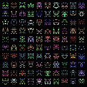
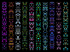
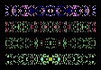
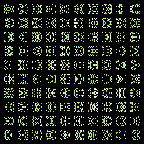
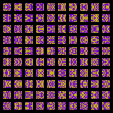

Generates a grid of random pixel-art icons.

Compile with Rust: `cargo build --release`

Run `pixel_icons_generator --help` for the available command-line arguments.

# Examples

`pixel_icons_generator -x_mirror`

`pixel_icons_generator --x-mirror --width 10 --height 100 --rows 1`

`pixel_icons_generator -c 1 -r 4 -w 100 -g 12 -p 6 -x -y`

`pixel_icons_generator -u -y`

`pixel_icons_generator -u -y -n 100 -k 2`

